<!-- Generated by `npm run build` from src/content.json, src/tokens.json and this template. Do not edit README.md by hand. -->

<picture><source media="(prefers-color-scheme: dark)" srcset="assets/hero-dark.svg"></picture>

<picture><source media="(prefers-color-scheme: dark)" srcset="assets/divider-1-dark.svg"></picture>

## About

I'm Felipe Teixeira Farias, a Junior Full Stack Developer at Softwrench, working remotely with an international team.

I build web features for maintenance and asset management software (O&M and CMMS) used by solar energy operations in the US. Day to day that means C# and .NET with SQL Server on the back end, and AngularJS on the front end.

I hold a technical degree in web development from ETEC and I'm working on my bachelor's at UNASP. Music is a big part of who I am.

<picture><source media="(prefers-color-scheme: dark)" srcset="assets/terminal-dark.svg"></picture>

<picture><source media="(prefers-color-scheme: dark)" srcset="assets/divider-2-dark.svg"></picture>

## Stack

<picture><source media="(prefers-color-scheme: dark)" srcset="assets/stack-dark.svg"></picture>

**Languages:** C#, JavaScript, SQL  
**Front-end:** AngularJS, HTML, CSS, Bootstrap  
**Back-end:** .NET  
**Database:** SQL Server  
**Tools:** Git  
Also shipped with Node.js, Express, Prisma, PostgreSQL and Docker on SAGA.

<picture><source media="(prefers-color-scheme: dark)" srcset="assets/divider-3-dark.svg"></picture>

## Projects

<a href="https://github.com/ftfariasdev/SAGA"><picture><source media="(prefers-color-scheme: dark)" srcset="assets/project-saga-dark.svg"></picture></a> <a href="https://github.com/ftfariasdev/ElixirBotForTelegram"><picture><source media="(prefers-color-scheme: dark)" srcset="assets/project-elixir-bot-dark.svg"></picture></a>

<a href="https://github.com/ftfariasdev/ftfariasdev.github.io"><picture><source media="(prefers-color-scheme: dark)" srcset="assets/project-portfolio-dark.svg"></picture></a> <a href="https://github.com/ftfariasdev/ftfariasdev"><picture><source media="(prefers-color-scheme: dark)" srcset="assets/project-profile-dark.svg"></picture></a>

- [SAGA](https://github.com/ftfariasdev/SAGA) — Academic management system, UNASP capstone, team of four
- [ElixirBotForTelegram](https://github.com/ftfariasdev/ElixirBotForTelegram) — Telegram bot that checks CPFs, College group project, five people
- [ftfariasdev.github.io](https://github.com/ftfariasdev/ftfariasdev.github.io) — My portfolio site, Vanilla HTML, CSS and JavaScript
- [ftfariasdev](https://github.com/ftfariasdev/ftfariasdev) — This profile, built by code, SVGs rendered from design tokens

<picture><source media="(prefers-color-scheme: dark)" srcset="assets/divider-4-dark.svg"></picture>

## Contribution farm

<picture><source media="(prefers-color-scheme: dark)" srcset="https://raw.githubusercontent.com/ftfariasdev/ftfariasdev/output/farm-dark.svg"></picture>

Rendered every day by a GitHub Action from my contribution calendar.

<picture><source media="(prefers-color-scheme: dark)" srcset="assets/divider-5-dark.svg"></picture>

## Off the clock

<a href="https://spotify-github-profile.kittinanx.com/api/view?uid=31ygxzb4eqcg4tqcipfxuxmf75qa&redirect=true"><picture><source media="(prefers-color-scheme: dark)" srcset="https://spotify-github-profile.kittinanx.com/api/view?uid=31ygxzb4eqcg4tqcipfxuxmf75qa&cover_image=true&theme=spotify-embed&show_offline=true&interchange=false&profanity=false&mode=dark&background_color=101B45&bar_color=FFCE5C&bar_color_cover=false"></picture></a>

<picture><source media="(prefers-color-scheme: dark)" srcset="assets/vu-meter-dark.svg"></picture>

Why does everything move in time?

Every animation on this page runs at one tempo, 96 BPM, set in src/tokens.json. Press play above and see if your song agrees.

<picture><source media="(prefers-color-scheme: dark)" srcset="assets/divider-6-dark.svg"></picture>

## Connect

<a href="https://www.linkedin.com/in/ftfariasdev"><picture><source media="(prefers-color-scheme: dark)" srcset="assets/connect-linkedin-dark.svg"></picture></a>&nbsp;&nbsp;<a href="https://ftfariasdev.github.io"><picture><source media="(prefers-color-scheme: dark)" srcset="assets/connect-portfolio-dark.svg"></picture></a>&nbsp;&nbsp;<a href="mailto:farias_felipe@outlook.com.br"><picture><source media="(prefers-color-scheme: dark)" srcset="assets/connect-email-dark.svg"></picture></a>

<a href="https://www.linkedin.com/in/ftfariasdev">linkedin.com/in/ftfariasdev</a>&nbsp;&nbsp;&nbsp;<a href="https://ftfariasdev.github.io">ftfariasdev.github.io</a>&nbsp;&nbsp;&nbsp;<a href="mailto:farias_felipe@outlook.com.br">farias_felipe@outlook.com.br</a>

<picture><source media="(prefers-color-scheme: dark)" srcset="assets/footer-dark.svg"></picture>

<a href="docs/HOW-IT-WORKS.md">How this profile is built</a>

